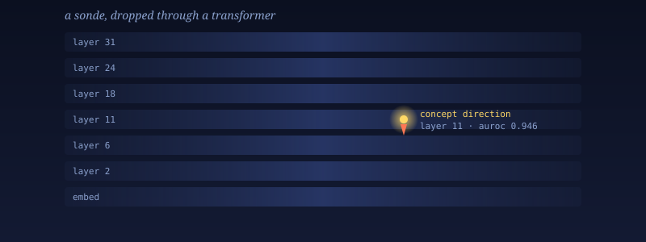
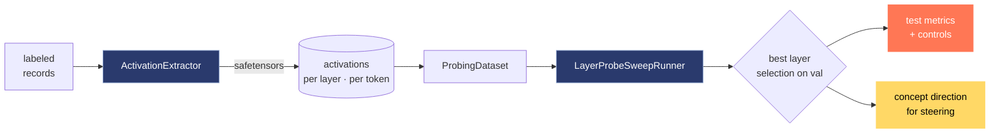

<p align="center">
  
</p>

<h1 align="center">sonde</h1>

<p align="center">
  <em>A slender probe cast into the hidden layers of a large model, to report back what it finds.</em>
</p>

<p align="center">
  <a href="https://github.com/aniruddh-alt/sonde/actions/workflows/ci.yml"></a>
  
  <a href="https://github.com/astral-sh/ruff"></a>
  
  
</p>

---

A **sonde**, in the scientific sense, is a small instrument sent into an otherwise inaccessible medium — a radiosonde riding a weather balloon through the stratosphere, a dropsonde spiraling through a hurricane, a medical sonde threading through tissue. The device is simple. The medium it probes is vast. The asymmetry is the point: a tiny, legible instrument lets you measure something you could never observe directly.

Modern transformers are such a medium. A 70B-parameter model holds tens of thousands of concepts, distributed across dozens of layers and millions of neurons, in a geometry that no human can read off the weights. And yet — the **linear representation hypothesis** tells us that most high-level concepts the model cares about are written along *directions* in activation space. Find the direction, and a single dot product tells you whether the concept is present right now, at this layer, for this token.

That dot product is a sonde.

This toolkit is for dropping them into models at scale.

## The pipeline



One YAML drives the whole thing. Activation → probe → layer-resolved answer, reproducibly.

## What `sonde` does

- **Extract activations** from any HuggingFace transformer at any layer, token, or internal module.
- **Train linear probes** — logistic regression, difference-of-means, ridge, and more — on those activations.
- **Sweep** across layers, token positions, and probe architectures to find *where* in the model a concept lives.
- **Report** test-set metrics, selectivity controls, and concept directions usable for downstream steering.

## Install

```bash
uv pip install -e .
```

## Quickstart: extract activations

```python
from dataset import ProbingSampleBuilder
from activation import ActivationExtractor
from configs import ActivationConfig, ModelConfig

records = [
    {"id": "ex-1", "text": "The capital of France is", "label": 1},
    {"id": "ex-2", "text": "The capital of Japan is",  "label": 0},
]
bundle = ProbingSampleBuilder.from_iterable(records).to_samples(text_key="text")

extractor = ActivationExtractor(
    ActivationConfig(
        model_config=ModelConfig(model_name="openai-community/gpt2"),
        save_path="artifacts/activations",
        activations=["layers_output:*"],   # every layer
    )
)
result = extractor.extract(bundle)
print(result["sample_ids"])
print(result["labels"])
```

## Quickstart: sweep probes across layers

```python
from dataset import ProbingDataset, ProbingSampleBuilder
from configs import LayerProbeSweepConfig, ProbeConfig
from probes import LayerProbeSweepRunner

dataset = ProbingDataset.from_extraction_result(
    extraction_result,
    activation_key="layers_output:0",
)
records = [
    {"id": extraction_result["sample_ids"][i], "text": f"sample-{i}", "label": int(extraction_result["labels"][i])}
    for i in range(len(extraction_result["labels"]))
]
bundle = ProbingSampleBuilder.from_iterable(records).to_samples(text_key="text")
train_idx, val_idx, test_idx = bundle.train_val_test_split(
    train_fraction=0.7, val_fraction=0.15, test_fraction=0.15,
    seed=0, group_ids=bundle.ids,
)
sweep = LayerProbeSweepRunner(
    LayerProbeSweepConfig(
        probe=ProbeConfig(epochs=10, learning_rate=1e-2),
        activation_targets=["layers_output:0"],
    )
)
result = sweep.run(
    extraction_result,
    train_indices=train_idx, val_indices=val_idx, test_indices=test_idx,
    group_ids=extraction_result["sample_ids"],
    manifest_path="artifacts/probe_runs/run_manifest.json",
)
print(result.best_key)
print(result.test_metrics)
print(result.controls)
```

Load directly from a saved extraction manifest:

```python
dataset = ProbingDataset.from_extraction_path(
    "artifacts/activations.pt",
    activation_key="layers_output:0",
)
```

If a manifest contains multiple activation streams, `activation_key` is required.

`LayerProbeSweepRunner.run(...)` requires explicit `train_indices`, `val_indices`, and
`test_indices` and evaluates test metrics only after selecting the best layer on validation.
If `manifest_path` already exists, the run fails by default. Use
`manifest_overwrite=True` to replace it or `manifest_unique_path=True` to auto-suffix
the filename.

`SampleBundle.train_val_test_split(...)` supports explicit `group_ids`; when omitted, it
can auto-group by sample IDs by default. Set `auto_group_by_id_when_none=False` to force
non-grouped stratification unless you pass `group_ids` explicitly.

## CLI

```bash
sonde run -c configs/my_experiment.yaml
```

## What you can probe

### Indexed activation kinds

| Kind | What it is |
|---|---|
| `layers_input` | residual stream entering each transformer block |
| `layers_output` | residual stream leaving each transformer block |
| `attentions_input` / `attentions_output` | attention sub-layer input/output |
| `mlps_input` / `mlps_output` | MLP sub-layer input/output |
| `attention_probabilities` | post-softmax attention weights (requires `enable_attention_probs=True`) |

### Selector syntaxes for indexed kinds

| Syntax | Meaning |
|---|---|
| `layers_output:5` | single layer |
| `layers_output` or `layers_output:*` or `layers_output:all` | every layer |
| `layers_output:0-4` | inclusive range |
| `layers_output:0:5` | slice |
| `layers_output:0:12:2` | slice with step |

### Non-indexed activation kinds

`token_embeddings` · `logits` · `next_token_probs` · `input_ids`

### Custom module hooks

- `module_input:layers[3].mlp.down_proj`
- `module_output:layers[3].mlp.gate_proj`

## Learn more

- **[docs/linear-probes-primer.md](docs/linear-probes-primer.md)** — a presentation-ready primer on linear probes: what they are, how to train them, where they're used, and the key papers.
- **`examples/refusal_probing/`** — a full end-to-end refusal-detection pipeline.

## Contributing

PRs welcome. See **[CONTRIBUTING.md](CONTRIBUTING.md)** for dev setup, lint/type/test loop, and the conventions we follow.
